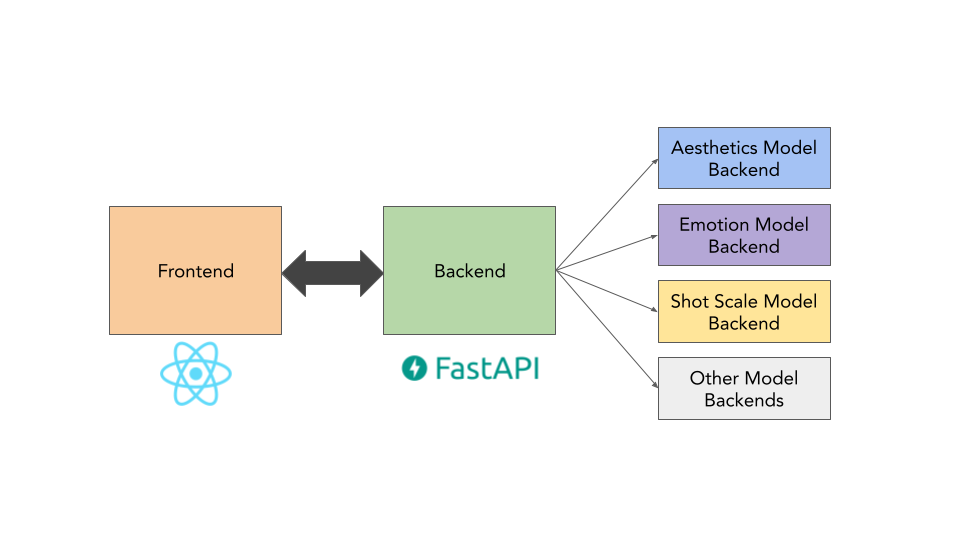

# Aesthetify

This repository contains the necessary code to run the Aesthetics demo application, which showcases the work carried out in the project [Aesthetic Assessment of Image and Video Content](https://mtc.ethz.ch/research/image-video-processing/aesthetics-assessment.html) at ETH Zurich Media Technology Center.

## Run the project

The architecture depicted above is composed of three main blocks. The frontend is the user interface that queries the API Backend to retrieved the images belonging to a user with the selected filtering criteria. When a user uploads a new image, this is processed by the API backend and sent to each of the model backends to run the predictions on the image. 

This design allows for separation of concerns, simplifies adding new models and allow to select the device on which each model backend is deployed.

### Run using docker-compose
The simplest way to run a project is to build the respective docker images and running them using the following command from the base directory:
```bash
docker-compose up --build
```

For development:
```bash
docker-compose -f docker-compose.yml -f docker-compose-debug.yml up --build
```


### Run using Helm/ K8s
If you have a local cluster on which you would like to deploy the project, use the following command from the `*-chart` directory:
```bash
helm install <releaseName> .
```


### Run locally
Running locally is usually somewhat inconvenient as the `Config` class requires certain ENV variables to be present. The required ENV variables can be found in the `.env` file and passed to your IDE in the run configurations. A tutorial of how to do this can be found here for [PyCharm](https://www.jetbrains.com/help/objc/add-environment-variables-and-program-arguments.html) or [VsCode](https://stackoverflow.com/questions/29971572/how-do-i-add-environment-variables-to-launch-json-in-vscode).


## Things to take into account

- Make sure to check out the [front-end README](/front-end/README.md) to configure authentication with Firebase.
- Then, enable authentication for each backend in the docker-compose files. 
- The app currently uses the old React front-end. For compatibility reasons, there's a `legacy_routes.py` file containing the routes that the old backend uses. This front-end containes commented code used for functionalities like video support or clustering, which will be again available in the next version of the app.
- When adding new models, you will have to register a new client in the api-backend and create a new model backend. You may want to add functionalities to the frontend to use the results of this new model as filtering criteria.


## Acknowledgments

App created by:

- Daniel Vera Nieto
- Thomas Steinmann
- Marc Willhaus